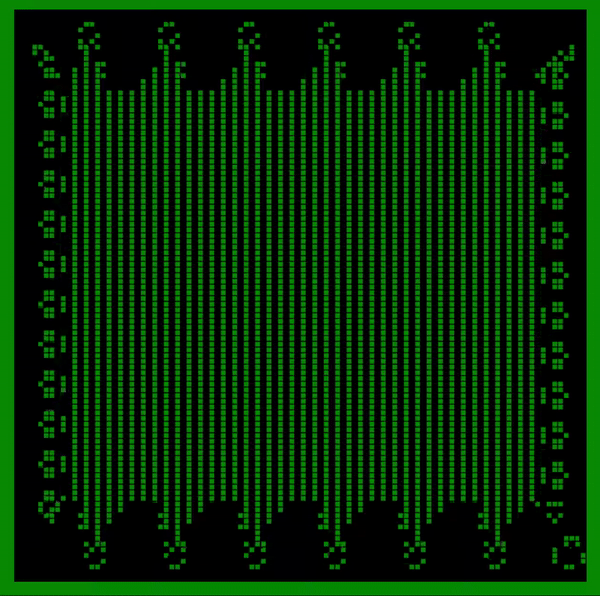

<div align="center">

  <h1><code>Conways Game of Life in RUST/WASM </code></h1>
  <p><code>by Harry Ghazni</code></p>



  <sub>Built with 🦀🕸 by <a href="https://rustwasm.github.io/">The Rust and WebAssembly Working Group</a></sub>
</div>

## About
My spin on the Rust WASM tutorial from the WASM site on Conways Game of Life.

## 🚴 Usage

### 🐑 Use `cargo generate` to Clone this Template

[Learn more about `cargo generate` here.](https://github.com/ashleygwilliams/cargo-generate)

```
cargo generate --git https://github.com/rustwasm/wasm-pack-template.git --name my-project
cd my-project
```

### 🛠️ Build with `wasm-pack build`

```
wasm-pack build
```

### 🔬 Test in Headless Browsers with `wasm-pack test`

```
wasm-pack test --headless --firefox
```

### 🎁 Publish to NPM with `wasm-pack publish`

```
wasm-pack publish
```

## 🔋 Batteries Included

* [`wasm-bindgen`](https://github.com/rustwasm/wasm-bindgen) for communicating
  between WebAssembly and JavaScript.
* [`console_error_panic_hook`](https://github.com/rustwasm/console_error_panic_hook)
  for logging panic messages to the developer console.
* [`wee_alloc`](https://github.com/rustwasm/wee_alloc), an allocator optimized
  for small code size.
